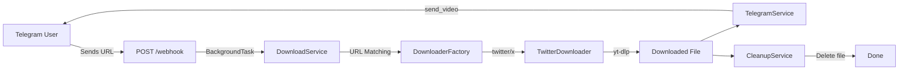

# Telegram Media Downloader Bot — Walkthrough

## What Was Built

A complete, production-ready Telegram bot using FastAPI that downloads videos from X (Twitter) posts and sends them back as Telegram messages. The project follows Clean Architecture with full extensibility for future platforms.

---

## Architecture Overview



---

## Files Created (24 files)

### Core Module
| File | Purpose |
|------|---------|
| [config.py](file:///c:/Users/abhir/Desktop/Projects/Media-downloader/app/core/config.py) | Pydantic Settings with `.env` loading, temp path & file size properties |
| [logger.py](file:///c:/Users/abhir/Desktop/Projects/Media-downloader/app/core/logger.py) | Centralized logger factory with consistent formatting |
| [constants.py](file:///c:/Users/abhir/Desktop/Projects/Media-downloader/app/core/constants.py) | Platform regex patterns + all user-facing message templates |

### Downloaders
| File | Purpose |
|------|---------|
| [base.py](file:///c:/Users/abhir/Desktop/Projects/Media-downloader/app/downloaders/base.py) | Abstract `BaseDownloader` + `DownloadError` / `UnsupportedPlatformError` |
| [twitter.py](file:///c:/Users/abhir/Desktop/Projects/Media-downloader/app/downloaders/twitter.py) | `TwitterDownloader` using yt-dlp with async thread offloading |
| [factory.py](file:///c:/Users/abhir/Desktop/Projects/Media-downloader/app/downloaders/factory.py) | `DownloaderFactory` with auto-registration and URL-to-platform matching |

### Services
| File | Purpose |
|------|---------|
| [telegram_service.py](file:///c:/Users/abhir/Desktop/Projects/Media-downloader/app/services/telegram_service.py) | Pure Telegram API wrapper — `send_message`, `send_video`, `send_photo` |
| [download_service.py](file:///c:/Users/abhir/Desktop/Projects/Media-downloader/app/services/download_service.py) | Orchestrates: validate → factory → download → return path |
| [cleanup_service.py](file:///c:/Users/abhir/Desktop/Projects/Media-downloader/app/services/cleanup_service.py) | Single file deletion + age-based batch cleanup |

### API & Entry Point
| File | Purpose |
|------|---------|
| [webhook.py](file:///c:/Users/abhir/Desktop/Projects/Media-downloader/app/api/webhook.py) | `POST /webhook` — parses updates, handles `/start` & `/help`, queues downloads as background tasks |
| [main.py](file:///c:/Users/abhir/Desktop/Projects/Media-downloader/app/main.py) | FastAPI app with lifespan startup/shutdown, health check at `GET /health` |

### Utilities
| File | Purpose |
|------|---------|
| [validators.py](file:///c:/Users/abhir/Desktop/Projects/Media-downloader/app/utils/validators.py) | `is_valid_url()`, `extract_platform()`, `is_supported_url()` |
| [file_utils.py](file:///c:/Users/abhir/Desktop/Projects/Media-downloader/app/utils/file_utils.py) | `ensure_directory()`, `get_file_size_mb()`, `generate_temp_filename()` |

### Infrastructure
| File | Purpose |
|------|---------|
| [requirements.txt](file:///c:/Users/abhir/Desktop/Projects/Media-downloader/requirements.txt) | All Python dependencies |
| [.env.example](file:///c:/Users/abhir/Desktop/Projects/Media-downloader/.env.example) | Configuration reference |
| [.gitignore](file:///c:/Users/abhir/Desktop/Projects/Media-downloader/.gitignore) | Python + media + temp exclusions |
| [Dockerfile](file:///c:/Users/abhir/Desktop/Projects/Media-downloader/Dockerfile) | Production-ready with ffmpeg, health check |
| [README.md](file:///c:/Users/abhir/Desktop/Projects/Media-downloader/README.md) | Full documentation |

---

## Key Design Decisions

1. **BackgroundTasks over Celery** — Webhook returns 200 immediately; download/upload runs in a FastAPI background task. Simple and sufficient for single-bot use.

2. **Thread offloading for yt-dlp** — `asyncio.to_thread()` runs the synchronous yt-dlp call without blocking the event loop.

3. **Factory pattern** — `DownloaderFactory` maps URL patterns to downloader instances. Adding Instagram/YouTube/etc. requires only: (a) new downloader class, (b) new regex pattern, (c) `factory.register()` call.

4. **Separation of concerns** — `TelegramService` only sends messages, `DownloadService` only orchestrates downloads, `CleanupService` only manages files. No cross-cutting logic.

---

## Test Results

```
36 passed in 0.35s ✅
```

| Test Suite | Tests | Status |
|------------|-------|--------|
| [test_validators.py](file:///c:/Users/abhir/Desktop/Projects/Media-downloader/tests/test_validators.py) | 18 | ✅ All passed |
| [test_factory.py](file:///c:/Users/abhir/Desktop/Projects/Media-downloader/tests/test_factory.py) | 4 | ✅ All passed |
| [test_download_service.py](file:///c:/Users/abhir/Desktop/Projects/Media-downloader/tests/test_download_service.py) | 6 | ✅ All passed |

---

## Next Steps to Run

1. Create a `.env` file from `.env.example` with your bot token
2. `uvicorn app.main:app --reload`
3. Expose with ngrok and set the Telegram webhook (see README)
